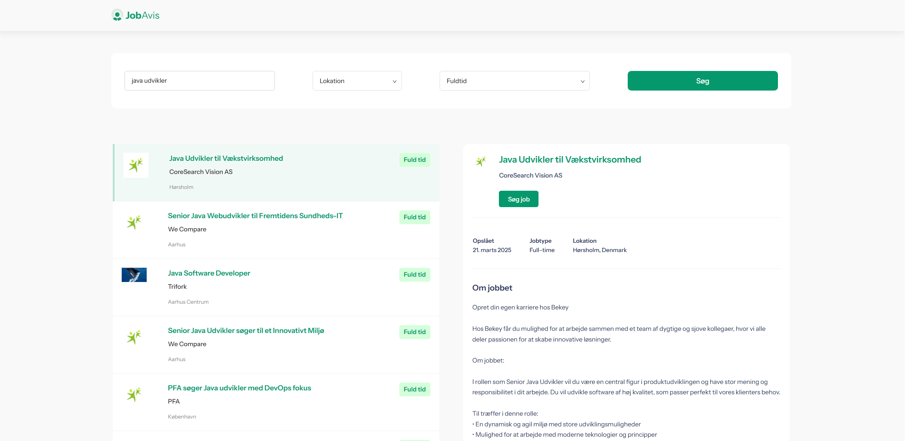
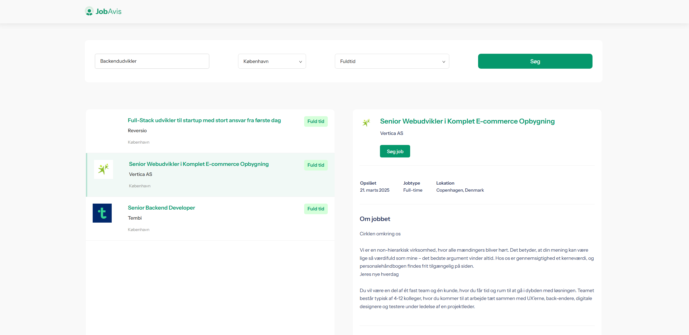

JobAvis is a personal project intent on simplifying the process of finding suitable jobs. It is however not as functional as I would've hoped, due to a lack of reliable APIs for the Danish job market.

It is not currently hosted. However, I do own Jobavis.dk.

The search query can be written in natural language, for instance "Java udvikler i københavn", which provides the most likely results for the query. The filtration process of the search query is a TF-IDF filtration system, comparing the job desc/title/location docs to search query terms.

The user can specify a city in Denmark with a dropdown, which lists all cities in Denmark. The next option is employment type: Fulltime, Parttime, etc. 

Filtration process of cities and employment types are straight forward and handled in the backend. 

The system has however not been put through thorough enough tests, simply due to lack of quality job information from my API.

Frontpage that you will meet:

An vague search query of "java udvikler": 

"Backendudvikler", but with lokation and employment type set:

